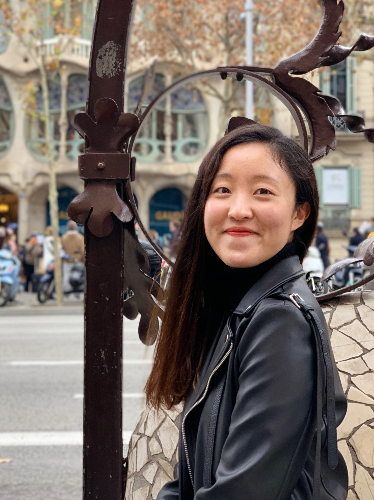

# Lab Members {-}

### 박사 / 통합과정 {-}

 

<table>

  <colgroup>
  <col style="width:20%">
  <col style="width:15%">
  <col style="width:60%">
  </colgroup>

  <tr>
    <td rowspan="4" align="center" valign="middle"></td>
    <td>성명</td>
	<td>강나윤</td>
  </tr>
  <tr>
    <td>이메일</td>
	<td>nayoonkang@yonsei.ac.kr</td>
  </tr>
  <tr>
    <td></td>
	<td>통합과정 (2019-1)</td>
  </tr>
  <tr>
    <td>연구실</td>
	<td>대우관 428호</td>
  </tr>
</table> 

<table>

  <colgroup>
  <col style="width:20%">
  <col style="width:15%">
  <col style="width:60%">
  </colgroup>

  <tr>
    <td rowspan="4" align="center" valign="middle"></td>
    <td>성명</td>
	<td>박진아</td>
  </tr>
  <tr>
    <td>이메일</td>
	<td>pja0707@yonsei.ac.kr</td>
  </tr>
    <tr>
    <td></td>
	<td>통합과정 (2019-1)</td>
  </tr>
  <tr>
    <td>연구실</td>
	<td>대우관 614호</td>
  </tr>
</table> 

<table>

  <colgroup>
  <col style="width:20%">
  <col style="width:15%">
  <col style="width:60%">
  </colgroup>

  <tr>
    <td rowspan="4" align="center" valign="middle"></td>
    <td>성명</td>
	<td>전예슬</td>
  </tr>
  <tr>
    <td>이메일</td>
	<td>jeon9677@yonsei.ac.kr</td>
  </tr>
  <tr>
    <td></td>
	<td>통합과정 (2019-1)</td>
  </tr>
  <tr>
    <td>연구실</td>
	<td>대우관 614호</td>
  </tr>
</table> 

<table>

  <colgroup>
  <col style="width:20%">
  <col style="width:15%">
  <col style="width:60%">
  </colgroup>

  <tr>
    <td rowspan="4" align="center" valign="middle"></td>
    <td>성명</td>
	<td>고동영</td>
  </tr>
  <tr>
    <td>이메일</td>
	<td>dy4091@naver.com</td>
  </tr>
    <tr>
    <td></td>
	<td>통합과정 (2019-2)</td>
  </tr>
  <tr>
    <td>연구실</td>
	<td>대우관 410호</td>
  </tr>
</table> 

<table>

  <colgroup>
  <col style="width:20%">
  <col style="width:15%">
  <col style="width:60%">
  </colgroup>

  <tr>
    <td rowspan="4" align="center" valign="middle"></td>
    <td>성명</td>
	<td>김인균</td>
  </tr>
  <tr>
    <td>이메일</td>
	<td>kiminkyun7@hanmail.net</td>
  </tr>
    <tr>
    <td></td>
	<td>통합과정 (2021-1)</td>
  </tr>
  <tr>
    <td>연구실</td>
	<td>대우관 322호</td>
  </tr>
</table> 

<table>

  <colgroup>
  <col style="width:20%">
  <col style="width:15%">
  <col style="width:60%">
  </colgroup>

  <tr>
    <td rowspan="4" align="center" valign="middle"></td>
    <td>성명</td>
	  <td>이승원</td>
  </tr>
  <tr>
    <td>이메일</td>
	  <td></td>
  </tr>
  <tr>
    <td></td>
	  <td>통합과정 (2022-1)</td>
  </tr>
  <tr>
    <td>연구실</td>
	  <td></td>
  </tr>
</table> 

 
 
 
 
 

### 석사과정 {-}

 

<table>

  <colgroup>
  <col style="width:20%">
  <col style="width:15%">
  <col style="width:60%">
  </colgroup>

  <tr>
    <td rowspan="4" align="center" valign="middle"></td>
    <td>성명</td>
	  <td>옥서연</td>
  </tr>
  <tr>
    <td>이메일</td>
	  <td>syook@yonsei.ac.kr</td>
  </tr>
  <tr>
    <td></td>
	  <td>석사과정 (2020-1)</td>
  </tr>
  <tr>
    <td>연구실</td>
	  <td>대우관 429호</td>
  </tr>
</table> 

<table>

  <colgroup>
  <col style="width:20%">
  <col style="width:15%">
  <col style="width:60%">
  </colgroup>

  <tr>
    <td rowspan="4" align="center" valign="middle"></td>
    <td>성명</td>
	  <td>송종호</td>
  </tr>
  <tr>
    <td>이메일</td>
	  <td>jh.song@yonsei.ac.kr</td>
  </tr>
  <tr>
    <td></td>
	  <td>석사과정 (2020-2)</td>
  </tr>
  <tr>
    <td>연구실</td>
	  <td>대우관 321호</td>
  </tr>
</table> 

<table>

  <colgroup>
  <col style="width:20%">
  <col style="width:15%">
  <col style="width:60%">
  </colgroup>

  <tr>
    <td rowspan="4" align="center" valign="middle"></td>
    <td>성명</td>
	  <td>엄상준</td>
  </tr>
  <tr>
    <td>이메일</td>
	  <td>esj205@naver.com</td>
  </tr>
    <tr>
    <td></td>
	  <td>석사과정 (2020-2)</td>
  </tr>
  <tr>
    <td>연구실</td>
	  <td>대우관 410호</td>
  </tr>
</table> 

<table>

  <colgroup>
  <col style="width:20%">
  <col style="width:15%">
  <col style="width:60%">
  </colgroup>

  <tr>
    <td rowspan="4" align="center" valign="middle"></td>
    <td>성명</td>
	<td>김현영</td>
  </tr>
  <tr>
    <td>이메일</td>
	<td>djfgxzk@naver.com</td>
  </tr>
    <tr>
    <td></td>
	<td>석사과정 (2021-1)</td>
  </tr>
  <tr>
    <td>연구실</td>
	<td>대우관 428호</td>
  </tr>
</table> 

<table>

  <colgroup>
  <col style="width:20%">
  <col style="width:15%">
  <col style="width:60%">
  </colgroup>

  <tr>
    <td rowspan="4" align="center" valign="middle"></td>
    <td>성명</td>
	<td>유은영</td>
  </tr>
  <tr>
    <td>이메일</td>
	<td>uare0@yonsei.ac.kr</td>
  </tr>
    <tr>
    <td></td>
	<td>석사과정 (2021-1)</td>
  </tr>
  <tr>
    <td>연구실</td>
	<td>대우관 321호</td>
  </tr>
</table> 

<table>

  <colgroup>
  <col style="width:20%">
  <col style="width:15%">
  <col style="width:60%">
  </colgroup>

  <tr>
    <td rowspan="4" align="center" valign="middle"></td>
    <td>성명</td>
	  <td>조수연</td>
  </tr>
  <tr>
    <td>이메일</td>
	  <td>tnduss521@naver.com</td>
  </tr>
  <tr>
    <td></td>
	  <td>석사과정 (2021-2)</td>
  </tr>
  <tr>
    <td>연구실</td>
	  <td>대우관 321호</td>
  </tr>
</table> 

<table>

  <colgroup>
  <col style="width:20%">
  <col style="width:15%">
  <col style="width:60%">
  </colgroup>

  <tr>
    <td rowspan="4" align="center" valign="middle"></td>
    <td>성명</td>
	  <td>김광희</td>
  </tr>
  <tr>
    <td>이메일</td>
	  <td>musagh08@naver.com</td>
  </tr>
  <tr>
    <td></td>
	  <td>석사과정 (2022-2)</td>
  </tr>
  <tr>
    <td>연구실</td>
	  <td>대우관 401호</td>
  </tr>
</table> 

 
 
 
 
 

### Alumni {-}

 

<table>

  <colgroup>
  <col style="width:20%">
  <col style="width:15%">
  <col style="width:60%">
  </colgroup>

  <tr>
    <td rowspan="4" align="center" valign="middle"></td>
    <td>성명</td>
	  <td>박선희</td>
  </tr>
  <tr>
    <td>이메일</td>
	  <td>sun488396@gmail.com</td>
  </tr>
    <tr>
    <td></td>
	  <td>삼성화재, Data Analytics 파트</td>
  </tr>
</table> 

<table>

  <colgroup>
  <col style="width:20%">
  <col style="width:15%">
  <col style="width:60%">
  </colgroup>

  <tr>
    <td rowspan="4" align="center" valign="middle"></td>
    <td>성명</td>
	  <td>박준용</td>
  </tr>
  <tr>
    <td>이메일</td>
	  <td>shewco3@gmail.com</td>
  </tr>
  <tr>
    <td></td>
	  <td>삼성전자, 소프트웨어연구소</td>
  </tr>
  
</table> 

<table>

  <colgroup>
  <col style="width:20%">
  <col style="width:15%">
  <col style="width:60%">
  </colgroup>

  <tr>
    <td rowspan="4" align="center" valign="middle"></td>
    <td>성명</td>
	  <td>최수영</td>
  </tr>
  <tr>
    <td>이메일</td>
	  <td>csy0922@yonsei.ac.kr</td>
  </tr>
    <tr>
    <td></td>
	  <td>동우화인켐, 분석기술팀</td>
  </tr>
</table> 

<table>

  <colgroup>
  <col style="width:20%">
  <col style="width:15%">
  <col style="width:60%">
  </colgroup>

  <tr>
    <td rowspan="4" align="center" valign="middle"></td>
    <td>성명</td>
	  <td>송도영</td>
  </tr>
  <tr>
    <td>이메일</td>
	  <td>do2872@naver.com</td>
  </tr>
  <tr>
    <td></td>
	  <td>삼성전자, 메모리사업부</td>
  </tr>
</table> 

<table>

  <colgroup>
  <col style="width:20%">
  <col style="width:15%">
  <col style="width:60%">
  </colgroup>

  <tr>
    <td rowspan="4" align="center" valign="middle"></td>
    <td>성명</td>
	  <td>최석준</td>
  </tr>
  <!-- <tr>
    <td>이메일</td>
	  <td>abc</td>
  </tr> -->
   <tr>
    <td></td>
	  <td>University of California, Santa Cruz, Ph.D. 과정</td>
  </tr>
</table> 

<table>

  <colgroup>
  <col style="width:20%">
  <col style="width:15%">
  <col style="width:60%">
  </colgroup>

  <tr>
    <td rowspan="4" align="center" valign="middle"></td>
    <td>성명</td>
	  <td>김현주</td>
  </tr>
  <tr>
    <td>이메일</td>
	  <td>hyunjookim11@naver.com</td>
  </tr>
</table> 

<table>

  <colgroup>
  <col style="width:20%">
  <col style="width:15%">
  <col style="width:60%">
  </colgroup>

  <tr>
    <td rowspan="4" align="center" valign="middle"></td>
    <td>성명</td>
	  <td>이정환</td>
  </tr>
  <tr>
    <td>이메일</td>
	  <td>junghwn1107@naver.com</td>
  </tr>
</table> 

<table>

  <colgroup>
  <col style="width:20%">
  <col style="width:15%">
  <col style="width:60%">
  </colgroup>

  <tr>
    <td rowspan="4" align="center" valign="middle"></td>
    <td>성명</td>
	<td>임수린</td>
  </tr>
  <tr>
    <td>이메일</td>
	  <td>srlim@yonsei.ac.kr</td>
  </tr>
</table> 

<table>

  <colgroup>
  <col style="width:20%">
  <col style="width:15%">
  <col style="width:60%">
  </colgroup>

  <tr>
    <td rowspan="4" align="center" valign="middle"></td>
    <td>성명</td>
	  <td>임지원</td>
  </tr>
  <tr>
    <td>이메일</td>
	  <td>sophi1127@yonsei.ac.kr</td>
  </tr>
  
</table> 

<!-- You can add parts to organize one or more book chapters together. Parts can be inserted at the top of an .Rmd file, before the first-level chapter heading in that same file.  -->

<!-- Add a numbered part: `# (PART) Act one {-}` (followed by `# A chapter`) -->

<!-- Add an unnumbered part: `# (PART\*) Act one {-}` (followed by `# A chapter`) -->

<!-- Add an appendix as a special kind of un-numbered part: `# (APPENDIX) Other stuff {-}` (followed by `# A chapter`). Chapters in an appendix are prepended with letters instead of numbers. -->

