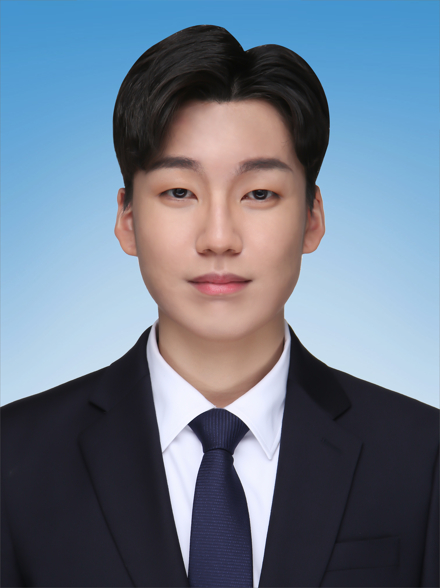
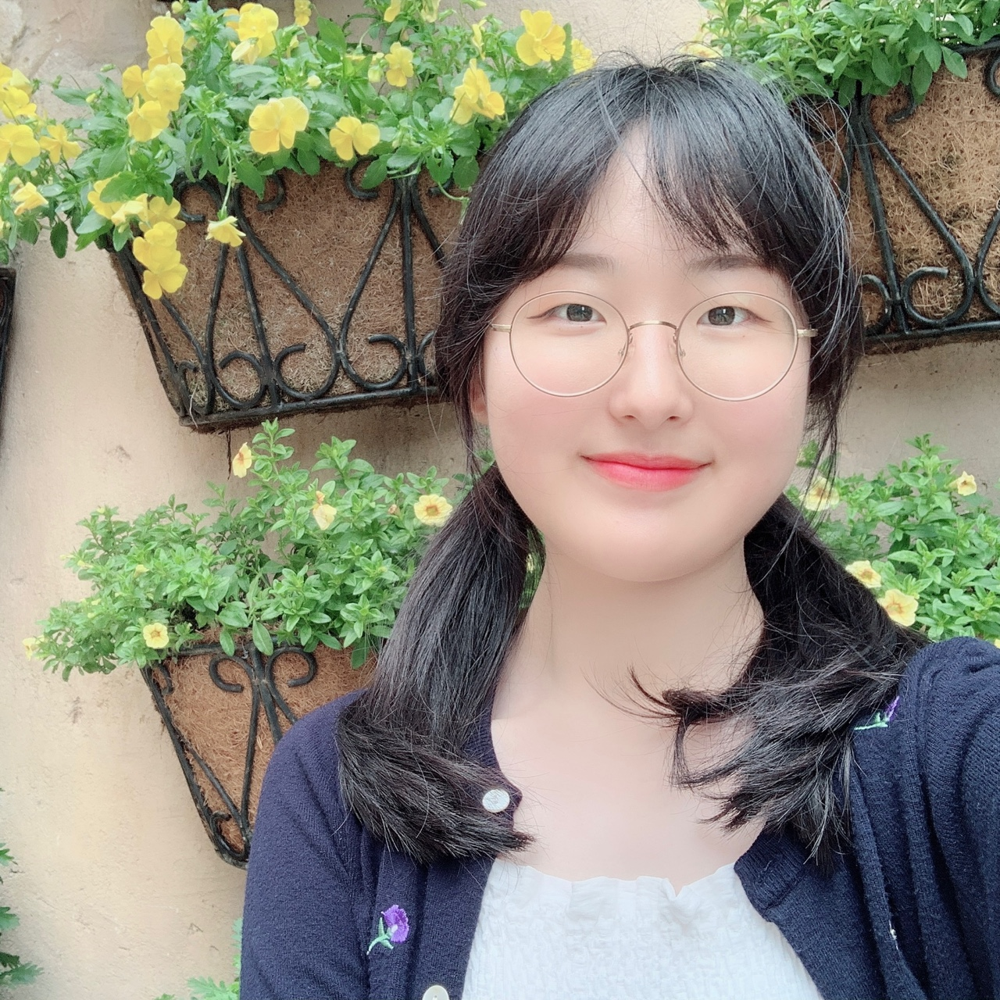
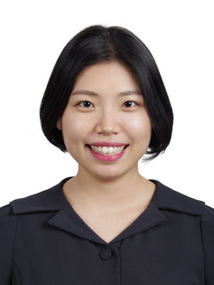
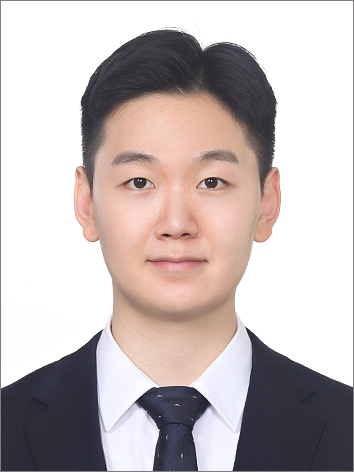

--- 
site: bookdown::bookdown_site
documentclass: book
bibliography:
- book.bib
- packages.bib
---

# About us {-}


연세대학교 통계데이터사이언스학과 진익훈 교수님 연구실 Jinius Lab입니다.

<hr style="border:2px solid gray"> </hr>

<div class="page-body">
  <h1 id="678b2ea1-d651-499f-9021-cd087067215b" class="">
    연구분야 및 구성원 소개
  </h1>
  <hr id="9585eb11-0382-4474-853e-be81f2e01658" />
  
  <h2 id="521d286a-db79-4f91-82a4-0e3182280b64" class="">연구분야</h2>
  <ul id="cc74cfe7-2885-4518-b8a0-62fc17668238" class="bulleted-list">
    <li style="list-style-type: disc">Bayesian Computation</li>
  </ul>
  <ul id="9a3a6c73-a849-4531-bd5d-d733f7598504" class="bulleted-list">
    <li style="list-style-type: disc">Network Analysis</li>
  </ul>
  <ul id="0581e13b-36b2-4dd0-bdea-8e33fefb1953" class="bulleted-list">
    <li style="list-style-type: disc">Spatial Data Analysis</li>
  </ul>
  <ul id="3c76ce6f-0134-4384-80e6-c5b90312d416" class="bulleted-list">
    <li style="list-style-type: disc">Latent Variable Model</li>
  </ul>
  <ul id="d0ef571b-cb2d-4017-90a3-ffd4d3faf7c4" class="bulleted-list">
    <li style="list-style-type: disc">
      Bayesian Adaptive Clinical Trial
    </li>
  </ul>
  <h2 id="e8272e1f-0233-4ec0-9ecc-f3b0ce301995" class="">구성원</h2>
  <ul id="298ecea7-32c4-4ff4-9a46-d2a68cc1300c" class="bulleted-list">
    <li style="list-style-type: disc">박사과정: 4명</li>
  </ul>
  <ul id="2286ee5f-9b0a-497b-92b5-50c0601c9941" class="bulleted-list">
    <li style="list-style-type: disc">
      석사과정: 9명 (석박통합과정 2명 포함)
    </li>
  </ul>
  <ul id="2286ee5f-9b0a-497b-92b5-50c0601c9941" class="bulleted-list">
    <li style="list-style-type: disc">
      학부연구생: 2명
    </li>
  </ul>
  <ul id="a453a88e-35c7-4214-bc56-3a75f0f25203" class="bulleted-list">
    <li style="list-style-type: disc">
      랩장: 박진아 (pja0707@yonsei.ac.kr)
    </li>
  </ul>
  <ul id="6bdf73f9-39e5-4446-aa78-5ac2c5583a66" class="bulleted-list">
    <li style="list-style-type: disc">
      랩에 관해 문의가 있을 경우 랩장 박진아 박사과정에게 문의하면
      성실하게 대답해줄 것임.
    </li>
  </ul>
  <h1 id="fcb411dd-a227-4753-a984-7a81beda848a" class="">
    연구실 시스템
  </h1>
  <hr id="ed984a62-1abf-4007-9974-7596d620154a" />
  <ul id="bd131629-0768-41e3-9fe3-81361fa641d1" class="bulleted-list">
    <li style="list-style-type: disc">
      석사 1학기의 경우 연구실 소속 신입생들끼리 모여 신입생 스터디를
      진행함.
    </li>
  </ul>
  <ul id="36b92f2d-ad42-4882-b5ad-73be175a4ff1" class="bulleted-list">
    <li style="list-style-type: disc">
      신입생 스터디 내용
      <ul id="07a8edef-7e74-4a67-b1cb-9688065e9822" class="bulleted-list">
        <li style="list-style-type: circle">
          기본적인 네트워크 통계 모형에 대한 학습.
        </li>
      </ul>
      <ul id="0393d4f5-88b5-41d5-a396-eca57d8929f7" class="bulleted-list">
        <li style="list-style-type: circle">
          기본적인 프로그래밍 숙달 (C, C++, RCpp).
        </li>
      </ul>
    </li>
  </ul>
  <ul id="458167ce-1614-4c8c-b6fb-ddc2c033cc56" class="bulleted-list">
    <li style="list-style-type: disc">
      석사 2학기부터 본격적인 연구 시작.
      <ul id="0c72bcac-fff5-4a3e-839d-9347a90cafd1" class="bulleted-list">
        <li style="list-style-type: circle">
          학위 논문 과정의 경우 연구 논문 작성.
        </li>
      </ul>
      <ul id="9644abce-e3c2-404f-9b82-2bff46e3e284" class="bulleted-list">
        <li style="list-style-type: circle">
          비학위 논문 과정의 경우 리뷰 논문 작성.
        </li>
      </ul>
    </li>
  </ul>
  <ul id="67e79692-fffa-4a73-a73e-52461563f178" class="bulleted-list">
    <li style="list-style-type: disc">
      현재 학생 실적
      <ul id="505578b2-d085-4a40-afae-cc5396ae6e73" class="bulleted-list">
        <li style="list-style-type: circle">
          박사과정 학생 논문 4편 투고 중 (AOAS, BA, Plos One,
          Psychometrika)
        </li>
      </ul>
      <ul id="0eb8f9bb-e347-4d8b-8808-42c9b2b9c426" class="bulleted-list">
        <li style="list-style-type: circle">
          박사과정 학생 논문 2편 / 석사과정 학생 논문 1편 투고 예정
          (Biometrics, JSS, JASA)
        </li>
      </ul>
    </li>
  </ul>
  <h1 id="788356fa-1b88-4eb0-bcdf-c65969aecf03" class="">
    현재 관심있는 연구 주제
  </h1>
  <hr id="10d95052-9c7e-41fa-9b4c-9b93a405d258" />
  <ul id="80fd22cd-025b-4d76-bd72-a72e2dc1aa0e" class="bulleted-list">
    <li style="list-style-type: disc">
      연결 시간 및 전달 속도를 가진 네트워크 분석.
    </li>
  </ul>
  <ul id="23823cd4-0724-44f4-8ce5-3d6ce941dd2f" class="bulleted-list">
    <li style="list-style-type: disc">
      복수의 네트워크를 가지고 있는 두 집단 간의 차이 검정 및 군집 분석.
    </li>
  </ul>
  <ul id="810f9a0b-92b6-441e-953d-134bf720f7ef" class="bulleted-list">
    <li style="list-style-type: disc">
      네트워크 군집 내에서의 각 구성원들 간의 트리 구조 파악.
    </li>
  </ul>
  <ul id="b8fd0fd0-295b-4b3a-8b88-1e28c1bfe82f" class="bulleted-list">
    <li style="list-style-type: disc">사회적 영향과 선택 분석.</li>
  </ul>
  <ul id="acd34cd4-21db-44c7-ac2e-d8ff677d2f27" class="bulleted-list">
    <li style="list-style-type: disc">네트워크 차원 축소.</li>
  </ul>
  <ul id="c0567a60-8cbd-442a-88ed-d147f2ae2ffe" class="bulleted-list">
    <li style="list-style-type: disc">
      공간이 네트워크 구조에 주는 영향 분석.
    </li>
  </ul>
  <ul id="fff5e261-5a85-4d2b-8585-e88cad0fd177" class="bulleted-list">
    <li style="list-style-type: disc">
      베이지안 적응 할당을 이용한 치료법 추천 알고리즘 개발.
    </li>
  </ul>
  <h1 id="faaca72e-e0e7-4ef2-94ac-44ee3391b004" class="">
    연구원이 얘기하는 연구실의 장단점
  </h1>
  <hr id="cb87e423-a93a-4f1a-8975-0d75daade01d" />
  <ul id="c5491dfc-b6f5-45b5-b483-11978e539a1f" class="bulleted-list">
    <li style="list-style-type: disc">
      장점
      <ul id="f123ebe8-02d1-4081-bff9-91e4de19cf99" class="bulleted-list">
        <li style="list-style-type: circle">
          여러 주제에 대한 연구 기회가 많다.
        </li>
      </ul>
      <ul id="b687fd5c-6f1f-47a6-8547-4a7c92e146e2" class="bulleted-list">
        <li style="list-style-type: circle">
          교수님께서 학생이 따라오는 수준을 고려해서 방향을 잡고
          인도해주신다.
        </li>
      </ul>
      <ul id="1bfcc5e0-4430-43f7-aafd-f679216bb575" class="bulleted-list">
        <li style="list-style-type: circle">
          최신의 연구를 할 수 있도록 교수님께서 방향을 잡아주신다.
        </li>
      </ul>
      <ul id="6e5f0681-a5da-4718-a3a1-cf3600e5d2aa" class="bulleted-list">
        <li style="list-style-type: circle">
          면담을 자주 하면서 다방면으로 관리를 잘 해주신다.
        </li>
      </ul>
      <ul id="4d08a41d-cada-4c9e-9d71-7903bce8b553" class="bulleted-list">
        <li style="list-style-type: circle">
          연구실에 서로 잘 챙겨주는 문화가 있고 서로 많이 도와준다.
        </li>
      </ul>
      <ul id="af1eaa3e-9da2-4cc4-b443-f86d19393a8c" class="bulleted-list">
        <li style="list-style-type: circle">
          연구실 사람들의 관심사가 다양하다.
        </li>
      </ul>
      <ul id="0e3500fe-9139-482b-9230-4a5f65471e75" class="bulleted-list">
        <li style="list-style-type: circle">
          교수님과 연락이 잘된다. (빠르다)
        </li>
      </ul>
      <ul id="25f1b335-4abb-4ee2-bea4-79fd88b493de" class="bulleted-list">
        <li style="list-style-type: circle">
          학생들이 재정적으로 도움을 받을 수 있도록 노력해주신다.
        </li>
      </ul>
      <ul id="80f56935-f5ff-4401-8047-a0be16b058bc" class="bulleted-list">
        <li style="list-style-type: circle">
          교수님의 인적 네트워크가 탄탄하시다.
        </li>
      </ul>
    </li>
  </ul>
  <ul id="52af58cd-cdff-4000-b1a8-5325441a1985" class="bulleted-list">
    <li style="list-style-type: disc">
      단점
      <ul id="9bd2522e-e301-429c-9903-de5a8fdfa7ca" class="bulleted-list">
        <li style="list-style-type: circle">
          지도제자 수가 다른곳에 비해 많은 편이다.
        </li>
      </ul>
      <ul id="ba8cb700-c64a-4c39-81ee-fce421f23d39" class="bulleted-list">
        <li style="list-style-type: circle">
          교수님과 연구스타일이 맞지 않으면 힘들 수도 있다.
        </li>
      </ul>
      <ul id="a7acbcfb-2cb8-43f1-9b82-121891b00c27" class="bulleted-list">
        <li style="list-style-type: circle">
          수업과 병행할때 일이 조금 많아질 수도 있다.
        </li>
      </ul>
      <ul id="be72caee-feae-4fdd-b495-ab403b53f128" class="bulleted-list">
        <li style="list-style-type: circle">
          교수님이랑 미팅할 때 빛 반사로 인해 눈이 너무 부신다.
        </li>
      </ul>
    </li>
  </ul>
  <p id="0d8c4c7c-9349-4de5-8554-65ab714f7f52" class=""></p>
  <p id="c1284f98-f575-4a56-b2ad-d8e53bd23dd5" class=""></p>
</div>

<hr style="border:2px solid gray"> </hr>

<!-- ```{r, eval=FALSE} -->
<!-- bookdown::render_book() -->
<!-- ``` -->


```{r include=FALSE}
# automatically create a bib database for R packages
knitr::write_bib(c(
  .packages(), 'bookdown', 'knitr', 'rmarkdown'
), 'packages.bib')
```

<!--chapter:end:index.Rmd-->

# Professor {-}

<table>

  <colgroup>
  <col style="width:20%">
  <col style="width:15%">
  <col style="width:60%">
  </colgroup>

  <tr>
    <td rowspan="3" align="center" valign="middle"></td>
    <td>**성명**</td>
	<td>진익훈</td>
  </tr>
  <tr>
    <td>**Contact**</td>
	<td>*Cell*: 82-10-9164-1597 <br>
	*Office*: 82-2-2123-2541 <br>
	*E-mail*: ijin@yonsei.ac.kr
	</td>
    </tr>
    <tr>
    <td>**Mailing**<br>**Address**</td>
	<td>421 Daewoo Hall, Yonsei University  <br>
	50 Yonsei-ro, Seodaemun  <br>
	Seoul, Rep. of Korea, 03722 </td>
</tr>
</table><br>

<br>
<br>
<br>

## Academic Appointment {-}

----

- Yonsei University, Seoul, Republic of Korea. <br> 
Assistant Professor, Department of Applied Statistics, <br>Sept. 2019 - .

- University of Notre Dame, Notre Dame, Indiana. <br> 
Assistant Professor, Department of Applied and Computational Mathematics and Statistics, <br>July 2015 - May 2019.

- The Ohio State University Wexner Medical Center, Columbus, Ohio. <br> 
Research Scientist, Center for Biostatistics, <br>September 2014 - June 2015.

- The University of Texas MD Anderson Cancer Center, Houston, Texas. <br> 
Postdoctoral Fellow, Biostatistics, <br>August 2011 - August 2014. <br> 
*Mentor: Dr. Ying Yuan and Dr. Peter F. Thall*

<br>
<br>

#### Education {-}

----

- Texas A&M University, College Station, Texas. <br> 
Ph.D., Statistics, August 2011. <br> 
*Advisor: Dr. Faming Liang*

- Yonsei University, Seoul, Republic of Korea. <br> 
M.A., Applied Statistics, February 2006. <br> 
B.A., Applied Statistics, Business Administration, February 2004.

<br>
<br>

## Publications {-}

----

Students are italic. ＊ for as corresponding author.
	
1. **Jin, I.H.** and Liang, F. (2013) [Fitting social network models using varying truncation stochastic approximation MCMC algorithms.](https://www.researchgate.net/publication/241724330_Fitting_Social_Network_Models_Using_Varying_Truncation_Stochastic_Approximation_MCMC_Algorithm) Journal of Computational and Graphical Statistics. Vol. 22. No. 4: pp. 927-952. <br>**Selected as JCGS highlights at the Interface 2012: Future of Statistical Computing**

2. Liang, F. and **Jin, I.H.** (2013) [A Monte Carlo Metropolis-Hasting algorithms for sampling from distributions with intractable normalizing constants](https://www.researchgate.net/publication/236264661_A_Monte_Carlo_Metropolis-Hastings_Algorithm_for_Sampling_from_Distributions_with_Intractable_Normalizing_Constants). Neural Computation, Vol. 25. No. 8: pp. 2199-2234.

3. **Jin, I.H.**, Yuan, Y., and Liang, F. (2013) [Bayesian analysis for exponential random graph models using the adaptive exchange sampler](https://www.researchgate.net/publication/260999601_Bayesian_Analysis_for_Exponential_Random_Graph_Models_Using_the_Adaptive_Exchange_Sampler). Statistics and Its Interface, Vol. 6: pp. 559-576.

4. **Jin, I.H.** and Liang, F. (2014) [Use of SAMC for Bayesian analysis of statistical models with intractable normalizing constants](https://www.researchgate.net/publication/228682695_Use_of_SAMC_for_Bayesian_Analysis_of_Statistical_Models_with_Intractable_Normalizing_Constants). Computational Statistics and Data Analysis. Vol. 71: pp. 402-416.

5. **Jin, I.H.**, Liu, S., Thall, P. F., and Yuan, Y. (2014) [Using data augmentation to facilitate conduct of phase Ⅰ/Ⅱ clinical trials with delayed outcomes](https://pubmed.ncbi.nlm.nih.gov/25382884/). Journal of the American Statistical Association. Vol. 109. No. 506: pp. 525-536.

6. **Jin, I.H.**, Huo, L., Yin, G., and Yuan, Y. (2015) [Phase Ⅰ trial design for drug combinations with Bayesian model averaging](https://pubmed.ncbi.nlm.nih.gov/25641851/). Pharmaceutical Statistics, Vol. 14. No. 2: pp. 109-119.

7. Liang, F., **Jin, I.H.**, Song, Q, and J.S. Liu. (2016) [An adaptive exchange algorithm for sampling from distribution with intractable normalizing constants](https://www.researchgate.net/publication/272376704_An_Adaptive_Exchange_Algorithm_for_Sampling_From_Distributions_With_Intractable_Normalizing_Constants). Journal of the American Statistical Association. Vol. 111. No. 513: pp. 377-393.

8. **Jin, I.H.**, Yuan, Y., and Bandyopadhyay, D. (2016) [A Bayesian hierarchical spatial model for dental caries assessments using non-gaussian Markov random fields](https://www.researchgate.net/publication/305627921_A_Bayesian_hierarchical_spatial_model_for_dental_caries_assessment_using_non-Gaussian_Markov_random_fields). The Annals of Applied Statistics. Vol. 10. No. 2: pp. 884-905.

9. *Liu, H.*, **Jin, I.H.** and, Zhang, Z. (2018) [Structural Equation Modeling of Social Networks: Specification, Estimation, and Application](https://www.researchgate.net/publication/329215082_Structural_Equation_Modeling_of_Social_Networks_Specification_Estimation_and_Application). Multivariate Behavioral Research, Vol. 53. No. 5: pp.714-730. <br>**Awarded Tanaka Award: Most Outstanding Article in Multivariate Behavioral Research Volume 53.**

10. **Jin, I.H.**＊ and Jeon, M. (2019) [A Doubly Latent Space Joint Model for Local Item and Person Dependence in the Analysis of Item Response Data](https://www.researchgate.net/publication/326276196_A_Doubly_Latent_Space_Joint_Model_for_Local_Item_and_Person_Dependence_in_the_Analysis_of_Item_Response_Data). Psychometrika, Vol. 84. No. 1: pp. 236-260.

11. Nam, J. H., Yun, J., **Jin, I.H.**＊, and Chung, D. (2020) [hubViz: A Novel Tool for Hub-centric Visualization](https://www.researchgate.net/publication/341850019_hubViz_A_Novel_Tool_for_Hub-centric_Visualization). Chemometrics and Intelligent Laboratory Systems. Vol. 203. 104071.

12. Yun, J., Shin, M., **Jin, I.H.**＊, and Liang, F. (2020) [Stochastic approximation Hamiltonian Monte Carlo](https://arxiv.org/abs/1810.04811). Journal of Statistical Computation and Simulation. Vol. 90. No. 17: pp. 3135-3156.

13. *Che, C.*, **Jin, I.H.**, and Zhang, Z. (2021) [Network Mediation Analysis Using Model-based Eigenvalue Decompositiong](https://www.researchgate.net/publication/339371541_Network_Mediation_Analysis_Using_Model-Based_Eigenvalue_Decomposition). Structural Equation Modelin. Vol. 28. No. 1: pp. 148-161.

14. *Liu, H.*, **Jin, I.H.**, Zhang, Z, and Yuan, Y. (2021) [Social Network Mediation Analysis: Latent Space Approach](https://arxiv.org/abs/1810.03751). Psychometrika. Vol. 86. No. 1: pp. 272-298.

15. Jeon, M., **Jin, I.H.**, Schweinberger, M., and Baugh, S. (2021) [Mapping unobserved item-respondent interactions: A latent space item response model with interaction map](https://arxiv.org/abs/2007.08719). Psychometrika. Vol. 86. No. 2: pp. 378-403.

16. Y. Zhang, S. Cao, C. Zhang, **Jin, I.H.**, and Zang, Y. (2021) [A Bayesian Adaptive Phase I/II Clinical Trial Design with Late-onset Competing Risk Outcomes.](https://doi.org/10.1111/biom.13347) Biometrics. In Press. 

17. Park, J., **Jin, I.H.**＊, and Schweinberger, M. (2022) [Bayesian Model Selection for High-Dimensional Ising Models, with Applications to Educational Data](https://arxiv.org/abs/1911.07142). Computational Statistics and Data Analysis. Vol. 125: Article 107325.

18. Park, J., *Jeon, Y.*, Shin, M., Jeon, M., and **Jin, I.H.**＊ (2021) [Bayesian Shrinkage for Functional Network Models, with Applications to Longitudinal Item Response Data. Revision Journal of Computational and Graphical Statistics.](https://arxiv.org/abs/2006.13698) In Press. ArXiv:2006.13698.

19. Liu, F., *Eugenio, E.*, **Jin, I.H.**, and *Bowen, C. M.* (2021) [Differentially Private Synthesis of Social Network Structure via Exponential Random Graph Model](https://www.osti.gov/biblio/1668697). Journal of Survey Statistics and Methodology. Accepted

<br>
<br>

#### Submitted Manuscripts {-}

----

1. **Jin, I.H.**, Jeon, M., Schweinberger, M, and Lin, L. (2021) [Hierarchical Network Item Response Modeling for Discovering Differences Between Innovation and Regular School Systems in Korea.](https://arxiv.org/abs/1810.07876) Revision Submitted to Journal of Royal Statistical Society, Series C. ArXiv:1810.07876.

2. *D. Ko*, M. Jeon, S. Lee, **Jin, I.H.**＊, and Park. H. (2021) Hidden Structure of How Children Think about Themselves Differs from What Parents Think about Their Children. Revision Submitted to Plos One.

3. *Jeon, Y.*, Chung, D., *Park, J.*, and **Jin, I.H.**＊ (2021) [Network-based Trajectory Topic Interaction Map for Text Mining of COVID-19 Biomedical Literature](https://arxiv.org/abs/2106.07374). Revision Submitted to Annals of Applied Statistics.

4. Park, J. Kang, S. and **Jin, I.H.** (2021) Control of Frequentist Type I Error Rates in Hierarchical Linear Models for Multiregional Clinical Trials Using a Bayesian Approach. Revision Submitted to Journal of Biopharmaceutical Statistics.

5. **Jin, I.H.**＊, *Park, J.*, and Jeon, M. (2021) [How social network influences human behavior: An integrated latent space approach](https://arxiv.org/abs/2109.05200). Revision Invited to Psychometrika.

6. *D. Ko*, **Jin, I.H.**, and Im, J. (2021) Bayesian Nonparametric quantile regression with multiple proxy variables.

7. *Park, J.*, *Hu, W.*, **Jin, I.H.**, Liu. H., and Zhang, Y. (2021) Bayesian adaptive phase I/II clinical trial design with competing risk model in personalized medicine. Submitted to Journal of Royal Statistical Society, Series C.

8. **Jin, I.H.**, Liu, F., *Eugenio, E.*, Kim, J., and Liu, S. (2019) [Bayesian Hierarchical Spatial Model for Small Area Estimation with Non-ignorable Nonresponses and Its Applications to the NHANES Dental Caries Assessments.](https://arxiv.org/abs/1810.05297) Revision Invited to Annals of Applied Statistics. ArXiv:1810.05297. 

9. *Kim, H.*, Jeon, Y.J., Kim, H.C., **Jin, I.H.**, and Jung, S.J. (2021) Application of latent space item response model to clustering stressful life events and Beck Depression Inventory-II: Results from Korean epidemiological survey data. Submitted to Psychological Medicine.

<br>
<br>


#### Refereed Conference Proceeding {-}

----

1. Liu, F., *Eugenio, E.*, Jin, I.H, *Bowen, C. M.* (2020) [Differentially Private Generation of Social Networks via Exponential Random Graph Models](https://www.researchgate.net/publication/345376724_Differentially_Private_Generation_of_Social_Networks_via_Exponential_Random_Graph_Models), Proceedings of 2020 IEEE 44th Annual Computers, Software, and Applications Conference (COMPSAC). pp. 1695-1700.

<br>
<br>

#### Ongoing Project {-}

----

1. *You, K.*, Jeon, M., Kim, I., and **Jin, I.H.** (2021) Multiple Latent Spaces Comparisons Using the Topological Analysis.

2. Yun, J., *Kim, H.*, Jeon, M., **Jin, I.H.** (2021) Latent Space Accumulator Model for Interactions between Items and Respondents with Response Time

3. *Ko, D.*, *Park, J.*, *Park, J.*, Jeon, M., and **Jin, I.H.** (2021) LSIRM: An R Package for a Latent Space Item Response Model with an Interaction Map.

<br>
<br>

#### Unpublished Manuscript {-}

----

1. **Jin, I.H.** and Liang, F. (2009) Bayesian analysis for exponential random graph models using the double Metropolis-Hastings sampler. Technical Report 2009-097. Institute for Applied Mathematics and Computer Science, Texas A&M University.

2. *Brodersen, A.*, **Jin, I.H.**, Cheng, Y., and Jeon, M. (2021) [Applying the Network Item Response Model to Student Assessment Data.](https://arxiv.org/abs/2003.07657) ArXiv:2003.07657.

<br>
<br>

#### Teaching {-}

----

1. Texas A&M University, College Station, Texas USA 

	- **Lecturer**
		1. STAT 303: Statistical methods Summer 2009
		2. STAT 201: Elementary statistical inference Fall 2009
		3. STAT 201: Elementary statistical inference Spring 2010

	- **Teaching Assistant**
		1. STAT 211: Principal of Statistics (Fall 2006 - Spring 2009)
		2. STAT 630: Overview of Mathematical Statistics (Fall 2010, Spring 2011)
		3. STAT 611: Theory of Inference (Spring 2011)
		4. STAT 303: Statistical Methods (Summer 2011)

<br>

2. University of Notre Dame, Notre Dame, Indiana USA 

	- **Instructor**
		1. ACMS 40950: Topics in Statistics Fall 2015, 2016
		2. ACMS 60886: Applied Bayesian Statistics II Spring 2016, 2018
		3. ACMS 30540: Mathematical Statistics Fall 2016
		4. ACMS 60888: Statistical Computing and Monte Carlo Spring 2017, Fall 2018
		5. ACMS 30530: Introduction to Probability Fall 2017
		6. ACMS 40878: Statistical Computing with R Fall 2017, 2018, Spring 2019


<br>

3. Yonsei University, Seoul, Republic of Korea 

	- **Instructor**
		1. STA 4118: Causal Inference Fall 2019
		2. STA 6172: Statistical Computing for Data Science II Fall 2019, Spring 2021
		3. STA 4117: Data Science 2 - Network Data Analysis Spring 2020, Spring 2021
		4. STA 6800: Statistical Analysis of Network Spring 2020, Fall 2021
		5. STA 6160: Bayesian Analysis Fall 2020, Fall 2021
		6. STA 6171: Statistical Computing for Data Science I Fall 2020, Spring 2022
		7. STA 3126: Mathematical Statistics I Spring 2022

<br>
<br>

#### Editorial Service {-}

----

- Associate Editor, Communications for Statistical Applications and Methods, 2017 -

<br>
<br>


## Scholarly Career {-}

#### Grant Proposal {-}

----

- University of Notre Dame, Center for Informatics and Computational Sciences (2018 Seed Grant). "Incorporating Uncertainty in Plant Growth into Models of Coastal Sediment Accretion." Role: Co-PI, Funded, $32,000.

- Yonsei University, Research Grant for New Faculty. "Latent Space Rasch Model: Binary Item Response Matrix Using Network Modeling." 2019-2021. Role: PI, Funed, ₩30,000,000.

- Korean National Research Foundation. "Latent Space Generalized Linear Model and Its Applications." 2020-2024. Role: PI, Funded, ₩400,000,000

<br>
<br>

#### Award {-}

----

- Korean International Statistical Society Career Development Award, 2017.
- Tanaka Award: Most Outstanding Article in Multivariate Behavioral Research Volume 53.

<br>
<br>

#### Invited Presentations {-}

----

- MD Anderson Cancer Center, February, 2011.
- Complex Network Transition Workshop, SAMSI, June, 2011.
- Interface 2012: Future of Statistical Computing, May, 2012.
- Yonsei University, September, 2012.
- Konkuk University, September, 2012.
- University of California, Santa Cruz, February, 2013.
- Louisiana State University, April, 2013.
- Case Western Reserve University, May, 2013.
- American Institute of Mathematics Workshop, June, 2013.
- Joint Meeting of the IASC Satellite Conference for the 59th ISI WSC and the 8th Conference of the Asian Regional Section of the IASC, August, 2013.
- The University of Texas Health Science Center at Houston, November, 2013.
- Ohio State University Comprehensive Cancer Center, January, 2014.
- University of Waterloo, January, 2014.
- Washington University in St. Louis, February, 2014.
- University of Notre Dame, January, 2015.
- Symposium on Early Phase Dose Finding Methodology, April, 2015.
- KISS Invited Session, Korean Statistical Society Meeting 2016, May, 2016.
- 12th International Conference on MCQMC Method, August, 2016
- Western Michigan University, October, 2016
- University of Notre Dame (Department of Psychology), February, 2017
- University of California, Los Angeles (Graduate School of Education and Information Studies), March, 2017
- Statistical Inference for Biomedical Big Data Workshop, University of Florida, April, 2017
- Clinical Trial Design in the Era of Precision Medicine-Progress and Challenge, Indiana University, April, 2017.
- Purdue University, August, 2017.
- Indiana University-Purdue University Indianapolis, December, 2017.
- CMStatistics 2018, December, 2018.
- Yale University, January, 2019.
- University of California, San Francisco, March, 2019.
- Inha University, September, 2019.
- Annual Meeting of the International Society for Data Science and Analytics (Participated as Committee Member), May, 2020.
- Joint Statistical Meeting (JSM) 2020, August, 2020.
- Jeonnam National University, August, 2020.
- Seoul National University, September, 2020.
- Sungkyunkwan University, November, 2020.
- Samsung Medical Research Center, December, 2020.
- Korea University, April, 2021. 

<br>
<br>

#### Programming Languages {-}

----

C, R, Matlab, Julia, LaTeX.

<br>
<br>

#### Professional Memberships {-}

----

- American Statistical Association
- Institute of Mathematical Statistics
- International Society of Bayesian Analysis
- International Network of Social Network Analysis
- Korean International Statistical Society
- Korean Statistical Society

<!--chapter:end:02-professor.Rmd-->

# Lab Members {-}

### 박사 / 통합과정 {-}

<hr style="border:2px solid gray"> </hr>

<table>

  <colgroup>
  <col style="width:20%">
  <col style="width:15%">
  <col style="width:60%">
  </colgroup>

  <tr>
    <td rowspan="4" align="center" valign="middle"></td>
    <td>성명</td>
	<td>강나윤</td>
  </tr>
  <tr>
    <td>이메일</td>
	<td>nayoonkang@yonsei.ac.kr</td>
  </tr>
  <tr>
    <td></td>
	<td>통합과정 (2019-1)</td>
  </tr>
  <tr>
    <td>연구실</td>
	<td>대우관 428호</td>
  </tr>
</table><br>


<table>

  <colgroup>
  <col style="width:20%">
  <col style="width:15%">
  <col style="width:60%">
  </colgroup>

  <tr>
    <td rowspan="4" align="center" valign="middle"></td>
    <td>성명</td>
	<td>박진아</td>
  </tr>
  <tr>
    <td>이메일</td>
	<td>pja0707@yonsei.ac.kr</td>
  </tr>
    <tr>
    <td></td>
	<td>통합과정 (2019-1)</td>
  </tr>
  <tr>
    <td>연구실</td>
	<td>대우관 614호</td>
  </tr>
</table><br>


<table>

  <colgroup>
  <col style="width:20%">
  <col style="width:15%">
  <col style="width:60%">
  </colgroup>

  <tr>
    <td rowspan="4" align="center" valign="middle"></td>
    <td>성명</td>
	<td>전예슬</td>
  </tr>
  <tr>
    <td>이메일</td>
	<td>jeon9677@yonsei.ac.kr</td>
  </tr>
  <tr>
    <td></td>
	<td>통합과정 (2019-1)</td>
  </tr>
  <tr>
    <td>연구실</td>
	<td>대우관 614호</td>
  </tr>
</table><br>


<table>

  <colgroup>
  <col style="width:20%">
  <col style="width:15%">
  <col style="width:60%">
  </colgroup>

  <tr>
    <td rowspan="4" align="center" valign="middle"></td>
    <td>성명</td>
	<td>고동영</td>
  </tr>
  <tr>
    <td>이메일</td>
	<td>dy4091@naver.com</td>
  </tr>
    <tr>
    <td></td>
	<td>통합과정 (2019-2)</td>
  </tr>
  <tr>
    <td>연구실</td>
	<td>대우관 410호</td>
  </tr>
</table><br>


<table>

  <colgroup>
  <col style="width:20%">
  <col style="width:15%">
  <col style="width:60%">
  </colgroup>

  <tr>
    <td rowspan="4" align="center" valign="middle"></td>
    <td>성명</td>
	<td>김인균</td>
  </tr>
  <tr>
    <td>이메일</td>
	<td>kiminkyun7@hanmail.net</td>
  </tr>
    <tr>
    <td></td>
	<td>통합과정 (2021-1)</td>
  </tr>
  <tr>
    <td>연구실</td>
	<td>대우관 322호</td>
  </tr>
</table><br>


<table>

  <colgroup>
  <col style="width:20%">
  <col style="width:15%">
  <col style="width:60%">
  </colgroup>

  <tr>
    <td rowspan="4" align="center" valign="middle"></td>
    <td>성명</td>
	  <td>이승원</td>
  </tr>
  <tr>
    <td>이메일</td>
	  <td>l2sw_@naver.com</td>
  </tr>
  <tr>
    <td></td>
	  <td>통합과정 (2022-1)</td>
  </tr>
  <tr>
    <td>연구실</td>
	  <td>대우관 321호</td>
  </tr>
</table><br>

</br>
</br>
</br>
</br>
</br>


### 석사과정 {-}

<hr style="border:2px solid gray"> </hr>


<table>

  <colgroup>
  <col style="width:20%">
  <col style="width:15%">
  <col style="width:60%">
  </colgroup>

  <tr>
    <td rowspan="4" align="center" valign="middle"></td>
    <td>성명</td>
	  <td>옥서연</td>
  </tr>
  <tr>
    <td>이메일</td>
	  <td>syook@yonsei.ac.kr</td>
  </tr>
  <tr>
    <td></td>
	  <td>석사과정 (2020-1)</td>
  </tr>
  <tr>
    <td>연구실</td>
	  <td>대우관 429호</td>
  </tr>
</table><br>


<table>

  <colgroup>
  <col style="width:20%">
  <col style="width:15%">
  <col style="width:60%">
  </colgroup>

  <tr>
    <td rowspan="4" align="center" valign="middle"></td>
    <td>성명</td>
	  <td>송종호</td>
  </tr>
  <tr>
    <td>이메일</td>
	  <td>jh.song@yonsei.ac.kr</td>
  </tr>
  <tr>
    <td></td>
	  <td>석사과정 (2020-2)</td>
  </tr>
  <tr>
    <td>연구실</td>
	  <td>대우관 321호</td>
  </tr>
</table><br>


<table>

  <colgroup>
  <col style="width:20%">
  <col style="width:15%">
  <col style="width:60%">
  </colgroup>

  <tr>
    <td rowspan="4" align="center" valign="middle"></td>
    <td>성명</td>
	  <td>엄상준</td>
  </tr>
  <tr>
    <td>이메일</td>
	  <td>esj205@naver.com</td>
  </tr>
    <tr>
    <td></td>
	  <td>석사과정 (2020-2)</td>
  </tr>
  <tr>
    <td>연구실</td>
	  <td>대우관 410호</td>
  </tr>
</table><br>


<table>

  <colgroup>
  <col style="width:20%">
  <col style="width:15%">
  <col style="width:60%">
  </colgroup>

  <tr>
    <td rowspan="4" align="center" valign="middle"></td>
    <td>성명</td>
	<td>김현영</td>
  </tr>
  <tr>
    <td>이메일</td>
	<td>djfgxzk@naver.com</td>
  </tr>
    <tr>
    <td></td>
	<td>석사과정 (2021-1)</td>
  </tr>
  <tr>
    <td>연구실</td>
	<td>대우관 428호</td>
  </tr>
</table><br>


<table>

  <colgroup>
  <col style="width:20%">
  <col style="width:15%">
  <col style="width:60%">
  </colgroup>

  <tr>
    <td rowspan="4" align="center" valign="middle"></td>
    <td>성명</td>
	<td>유은영</td>
  </tr>
  <tr>
    <td>이메일</td>
	<td>uare0@yonsei.ac.kr</td>
  </tr>
    <tr>
    <td></td>
	<td>석사과정 (2021-1)</td>
  </tr>
  <tr>
    <td>연구실</td>
	<td>대우관 321호</td>
  </tr>
</table><br>


<table>

  <colgroup>
  <col style="width:20%">
  <col style="width:15%">
  <col style="width:60%">
  </colgroup>

  <tr>
    <td rowspan="4" align="center" valign="middle"></td>
    <td>성명</td>
	  <td>조수연</td>
  </tr>
  <tr>
    <td>이메일</td>
	  <td>tnduss521@naver.com</td>
  </tr>
  <tr>
    <td></td>
	  <td>석사과정 (2021-2)</td>
  </tr>
  <tr>
    <td>연구실</td>
	  <td>대우관 321호</td>
  </tr>
</table><br>

<table>

  <colgroup>
  <col style="width:20%">
  <col style="width:15%">
  <col style="width:60%">
  </colgroup>

  <tr>
    <td rowspan="4" align="center" valign="middle"></td>
    <td>성명</td>
	  <td>김광희</td>
  </tr>
  <tr>
    <td>이메일</td>
	  <td>musagh08@naver.com</td>
  </tr>
  <tr>
    <td></td>
	  <td>석사과정 (2022-1)</td>
  </tr>
  <tr>
    <td>연구실</td>
	  <td>대우관 401호</td>
  </tr>
</table><br>


</br>
</br>
</br>
</br>
</br>


### 학부연구생 {-}

<hr style="border:2px solid gray"> </hr>

<table>

  <colgroup>
  <col style="width:20%">
  <col style="width:15%">
  <col style="width:60%">
  </colgroup>

  <tr>
    <td rowspan="4" align="center" valign="middle"></td>
    <td>성명</td>
	<td>김경한</td>
  </tr>
  <tr>
    <td>이메일</td>
	<td>kyunghan@yonsei.ac.kr</td>
  </tr>
  <tr>
    <td></td>
	<td>학부연구생 (2022-1)</td>
  </tr>
</table><br>


<table>

  <colgroup>
  <col style="width:20%">
  <col style="width:15%">
  <col style="width:60%">
  </colgroup>

  <tr>
    <td rowspan="4" align="center" valign="middle"></td>
    <td>성명</td>
	<td>이미르</td>
  </tr>
  <tr>
    <td>이메일</td>
	<td>tianmir@yonsei.ac.kr</td>
  </tr>
    <tr>
    <td></td>
	<td>학부연구생 (2022-1)</td>
  </tr>
</table><br>


</br>
</br>
</br>
</br>
</br>


### Alumni {-}

<hr style="border:2px solid gray"> </hr>


<table>

  <colgroup>
  <col style="width:20%">
  <col style="width:15%">
  <col style="width:60%">
  </colgroup>

  <tr>
    <td rowspan="4" align="center" valign="middle"></td>
    <td>성명</td>
	  <td>박선희</td>
  </tr>
  <tr>
    <td>이메일</td>
	  <td>sun488396@gmail.com</td>
  </tr>
    <tr>
    <td></td>
	  <td>삼성화재, Data Analytics 파트</td>
  </tr>
</table><br>

<table>

  <colgroup>
  <col style="width:20%">
  <col style="width:15%">
  <col style="width:60%">
  </colgroup>

  <tr>
    <td rowspan="4" align="center" valign="middle"></td>
    <td>성명</td>
	  <td>박준용</td>
  </tr>
  <tr>
    <td>이메일</td>
	  <td>shewco3@gmail.com</td>
  </tr>
  <tr>
    <td></td>
	  <td>삼성전자, 소프트웨어연구소</td>
  </tr>
  
</table><br>

<table>

  <colgroup>
  <col style="width:20%">
  <col style="width:15%">
  <col style="width:60%">
  </colgroup>

  <tr>
    <td rowspan="4" align="center" valign="middle"></td>
    <td>성명</td>
	  <td>최수영</td>
  </tr>
  <tr>
    <td>이메일</td>
	  <td>csy0922@yonsei.ac.kr</td>
  </tr>
    <tr>
    <td></td>
	  <td>동우화인켐, 분석기술팀</td>
  </tr>
</table><br>

<table>

  <colgroup>
  <col style="width:20%">
  <col style="width:15%">
  <col style="width:60%">
  </colgroup>

  <tr>
    <td rowspan="4" align="center" valign="middle"></td>
    <td>성명</td>
	  <td>송도영</td>
  </tr>
  <tr>
    <td>이메일</td>
	  <td>do2872@naver.com</td>
  </tr>
  <tr>
    <td></td>
	  <td>삼성전자, 메모리사업부</td>
  </tr>
</table><br>

<table>

  <colgroup>
  <col style="width:20%">
  <col style="width:15%">
  <col style="width:60%">
  </colgroup>

  <tr>
    <td rowspan="4" align="center" valign="middle"></td>
    <td>성명</td>
	  <td>최석준</td>
  </tr>
  <!-- <tr>
    <td>이메일</td>
	  <td>abc</td>
  </tr> -->
   <tr>
    <td></td>
	  <td>University of California, Santa Cruz, Ph.D. 과정</td>
  </tr>
</table><br>

<table>

  <colgroup>
  <col style="width:20%">
  <col style="width:15%">
  <col style="width:60%">
  </colgroup>

  <tr>
    <td rowspan="4" align="center" valign="middle"></td>
    <td>성명</td>
	  <td>김현주</td>
  </tr>
  <tr>
    <td>이메일</td>
	  <td>hyunjookim11@naver.com</td>
  </tr>
</table><br>


<table>

  <colgroup>
  <col style="width:20%">
  <col style="width:15%">
  <col style="width:60%">
  </colgroup>

  <tr>
    <td rowspan="4" align="center" valign="middle"></td>
    <td>성명</td>
	  <td>이정환</td>
  </tr>
  <tr>
    <td>이메일</td>
	  <td>junghwn1107@naver.com</td>
  </tr>
</table><br>


<table>

  <colgroup>
  <col style="width:20%">
  <col style="width:15%">
  <col style="width:60%">
  </colgroup>

  <tr>
    <td rowspan="4" align="center" valign="middle"></td>
    <td>성명</td>
	<td>임수린</td>
  </tr>
  <tr>
    <td>이메일</td>
	  <td>srlim@yonsei.ac.kr</td>
  </tr>
</table><br>


<table>

  <colgroup>
  <col style="width:20%">
  <col style="width:15%">
  <col style="width:60%">
  </colgroup>

  <tr>
    <td rowspan="4" align="center" valign="middle"></td>
    <td>성명</td>
	  <td>임지원</td>
  </tr>
  <tr>
    <td>이메일</td>
	  <td>sophi1127@yonsei.ac.kr</td>
  </tr>
  
</table><br>


<!-- You can add parts to organize one or more book chapters together. Parts can be inserted at the top of an .Rmd file, before the first-level chapter heading in that same file.  -->

<!-- Add a numbered part: `# (PART) Act one {-}` (followed by `# A chapter`) -->

<!-- Add an unnumbered part: `# (PART\*) Act one {-}` (followed by `# A chapter`) -->

<!-- Add an appendix as a special kind of un-numbered part: `# (APPENDIX) Other stuff {-}` (followed by `# A chapter`). Chapters in an appendix are prepended with letters instead of numbers. -->


<!--chapter:end:03-labmembers.Rmd-->

